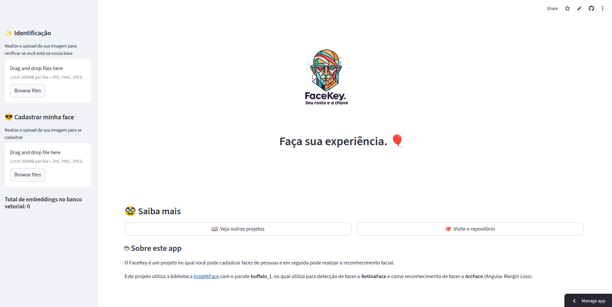

# FaceKey

## 1. Apresentação

Este é um projeto de reconhecimento facial feito com a biblioteca InsightFace, ChromaDB e Streamlit.

No FaceKey você pode realizar o upload de uma imagem e cadastrar a face. Também é possível
verificar se a face já está presente no banco de dados vetorial.



## 2. Características e Decisões Técnicas

- **Detecção de Face**: Escolhi o *RetinaFace* pois além de SOTA, retorna 5 pontos de landmark com
alta precisão, mesmo sob oclusão leve.
- **Reconhecimento de Face**: Escolhi o *ArcFace (Angular Margin Loss)* pois além de baixo custo
computacional (resnet-50), oferece uma alta precisão entre faces da mesma classe e aumento da
discrepância entre pessoas distintas.
- **Banco de Dados Vetorial**: Escolhi o *ChromaDB* pois se mostrou um ótimo banco para protótipos.
- **Manipulação de Imagem**: *OpenCV* é um lib de vasta documentação e facilidade de uso. 
- **Métrica de dissimilaridade**: Escolhi a *distância do cosseno*, pois modelos como ArcFace/FaceNet foram treinados focando no ângulo do vetor, além disso, L2 é muito sensível a iluminação
e magnitude da foto original.

## 3. Estrutura de Arquivos

```
face-key/
├── README.md                                    (este arquivo)
├── deteccao_facial.ipynb                        (jupyter notebook para experimentos/testes)
├── requirements.txt                             (dependências Python - streamlit)
├── requirements_gpu.txt                         (dependências Python - para rodar o jupyter notebook com GPU)
├── images/                                      (imagens para o projeto)
├   ├── logo.jpeg                                (logotipo)
├── utils/                                       (pasta de utilitários)
├   ├── chromadb_utils.py                        (funções para auxiliar no ChromaDB)
├   ├── cv2_utils.py                             (funções para auxiliar no OpenCV)
├── app.py                                       (arquivo principal streamlit)
├── rec_face.py                                  (arquivo insightface para rec. facial)
├── config.json                                  (arquivo de configuração auxiliar)
├── examples/                                    (pasta com imagens de faces para teste)
```

## 4. Instruções para rodar o projeto

### 1. Clone o repositório
```bash
git clone url-de-clone
cd face-key
```

### 2. Instale as dependências
Recomenda-se o uso de um ambiente virtual:
```bash
python -m venv facekey
# Ative o ambiente virtual:
# No Windows:
facekey\Scripts\activate
# No Linux/Mac:
source facekey/bin/activate
pip install -r requirements.txt
```

### 3. Execute o app
```bash
streamlit run app.py
```

## 5. Mais Informações
Você pode testar o app FaceKey no Streamlit Cloud [aqui](https://facekey.streamlit.app/).
